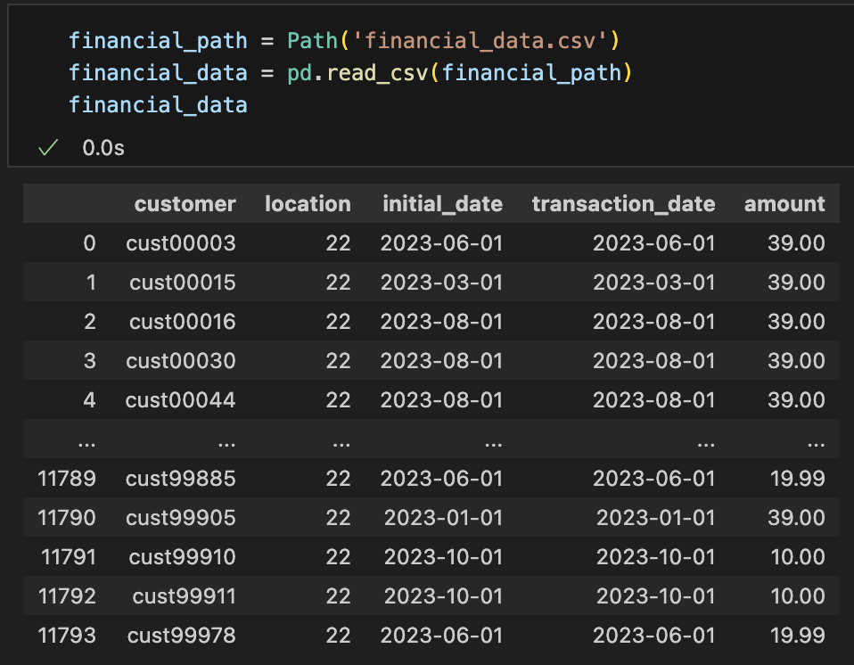

# Financial Analysis Repo

### Public portions of analysis of real, anonymized financial data.
##### Goal: Automatically generate a report for the company to review before moving forward with their quarterly report.
 

Data is loaded from `csv` in the following format:

This example is a small fraction of the data and only contains information from one `location` in a small range of dates (Around 11,000 transactions). In the full implementation, data will also be analyzed according to `location` to provide geo-specific insight into the company's success in relation to `location`.

 

The current repository only contains the foundation of the code that will be used to generate a full report. It is 
centered around detecting potential delinquent credit card charges or refunds.

 

This analysis flags and provides information on potentially misreported financial data, including outstanding charges, erroneous refunds, and unexplained jumps in the timing of charges and refunds. This generates a DataFrame such as

